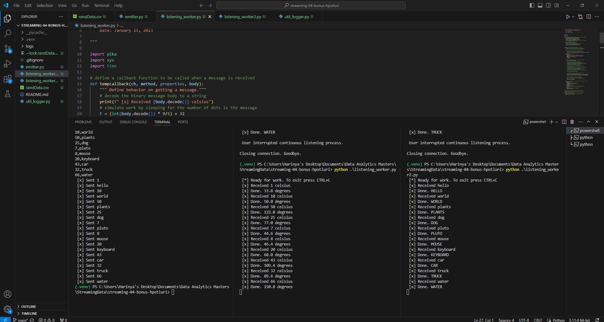

# streaming-04-bonus-hpotluri
by Harinya Potluri 5/23/24

## Description 
Using what we learned in HW 4, I made 2 listening workers that work on separate queues and receive data from an emitter that reads in data from a csv and splits up the messages and sends them on two different queues. 

In my first column, I convert temperture values from celsius to degrees. In my next column, I convert lowercase words to upper case words. 

I used the same code from HW4 but I retrofitted it with some changes to handle a new data file and also make two different listeners for the two different queues. I also need to make a new callback function for each listener. 

## Instructions 
1. Open 3 terminals and make sure to use a python env on it. 
2. Install pika 
3. Run both of the listeners in 2 terminals 
4. Run the emitter in the last terminal. 
5. Watch the code work. 

## Screenshot of the code working 
